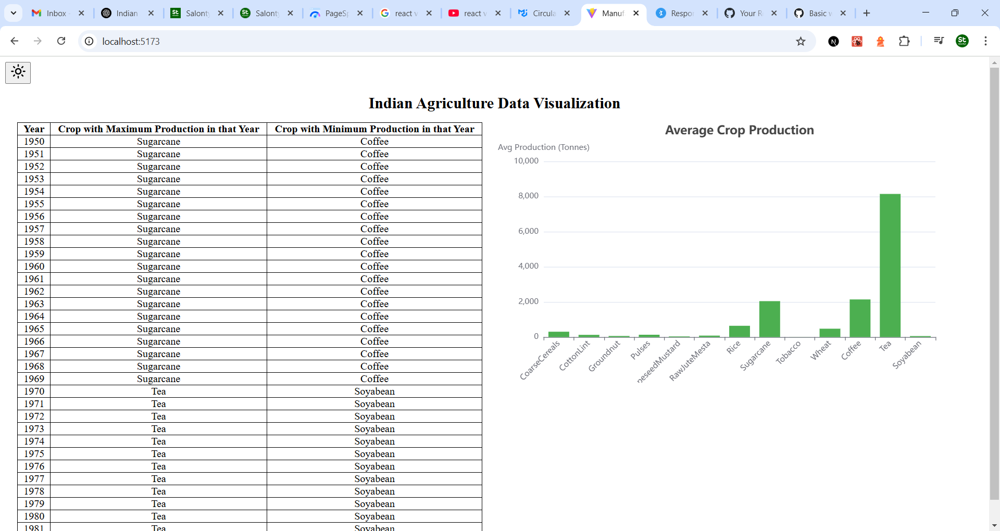

# 🌾 Indian Agriculture Data Visualization

This project is a **Frontend Data Analysis Task** for Manufac Analytics.  
It visualizes **Indian Agriculture data** using a **table** and **bar chart**.  
The UI supports **light and dark mode toggling**.

---

## 🚀 Live Demo

🔗 **[View Deployed App](https://manufac-assignment-nine.vercel.app/)** 

  

---

## 📌 Features

✅ **Table Component**: Shows crops with maximum and minimum production per year.  
✅ **Bar Chart Component**: Displays average crop production per crop.  
✅ **Mantine UI**: Used for UI components and theming.  
✅ **Apache ECharts**: For interactive data visualization.  
✅ **Light/Dark Mode Toggle**: Improves UI accessibility.

---

## 🛠️ How to Start the Project

You can either **clone the repository using Git** or **download the ZIP file**, install dependencies, and run the project.

---

## **🔹 Option 1: Clone Using Git (Recommended)**

### **1️⃣ Clone the Repository**

Open **Terminal (Mac/Linux) or Command Prompt (Windows)** and run:

```sh
git clone https://github.com/YOUR_USERNAME/manufac-assignment.git
cd manufac-analytics
```
